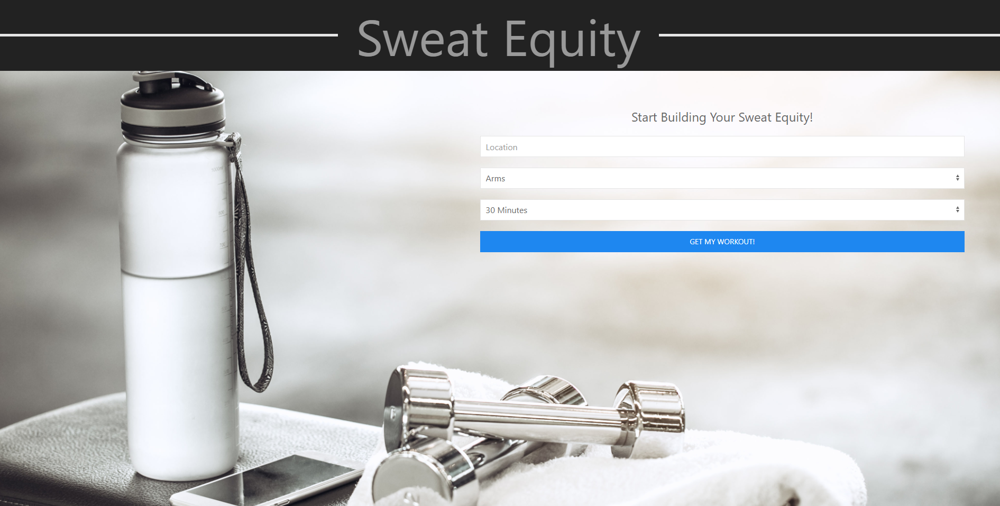

# Brogrammers
Group project one with Mac, Mitch and John.

We built this app in order to make working out easier for our users. Just input what body part you would like to target, your location, and how long you wish to workout for. Then, Sweat Equity does the rest! You will be presented with a google maps to find a gym by you, the weather forecast in case you wish to workout outside, and a full workout.

Try it out for yourself here: https://jczarfeld.github.io/Brogrammers/

Also, checkout our development story here: https://docs.google.com/presentation/d/1tVNUC9W8SWhBFV388vBkDOEBF5l_VE6y_TVom23TxUo/edit?usp=sharing

